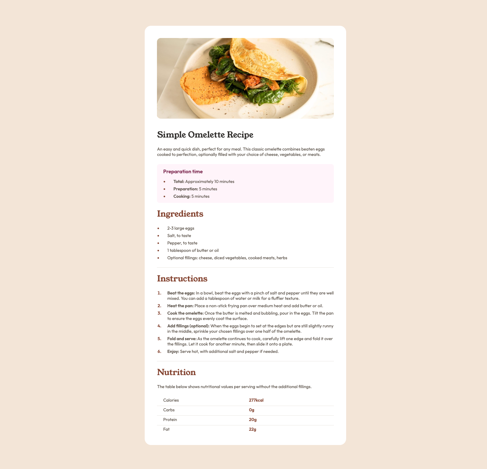

# Frontend Mentor - Recipe page solution

This is a solution to the [Recipe page challenge on Frontend Mentor](https://www.frontendmentor.io/challenges/recipe-page-KiTsR8QQKm). Frontend Mentor challenges help you improve your coding skills by building realistic projects. 

## Table of contents

- [Overview](#overview)
  - [Screenshot](#screenshot)
  - [Links](#links)
- [My process](#my-process)
  - [Built with](#built-with)
  - [What I learned](#what-i-learned)
  - [Continued development](#continued-development)
  - [Useful resources](#useful-resources)
- [Author](#author)
- [Acknowledgments](#acknowledgments)


## Overview

### Screenshot



### Links (Will be updated)

- Solution URL: [Solution URL]()
- Live Site URL: [Live site URL]()

## My process

### Built with

- Semantic HTML5 markup
- CSS custom properties
- Flexbox
- CSS Grid
- Mobile-first workflow

### What I learned

It's generally considered more effective to approach design from a mobile-first perspective. I learned this lesson firsthand during this challenge when I initially designed for desktop, placing the featured image in a container with padding. However, when I later attempted to design the mobile page, I encountered difficulties because I couldn't remove the padding without affecting other elements that depended on it. Consequently, I had to completely redo the design with a mobile-first approach.

<hr>

Neat way to add spacing / margin between the elements.
```css
/* Lobotomized owl */
main *+* {
    margin-top: 1.75rem;
}
```


### Continued development

Improve on:
- HTML layout
- Flexbox
- Grid


### Useful resources

Learn Flexbox and Grid the fun way:
- [Flexbox Froggy](https://flexboxfroggy.com/)
- [Grid Garden](https://cssgridgarden.com/)
- [Unfamiliar CSS patterns that improve on the classics](https://www.youtube.com/watch?v=OtqZKLdDNXY)

## Author

- Website - [Praveen Kumar](praveenkum11.github.io/portfolio)
- Frontend Mentor - [@PraveenKum11](https://www.frontendmentor.io/profile/PraveenKum11)
- Twitter - [@softwheredev](https://twitter.com/softwheredev)

## Acknowledgments

Once again, I extend a huge thanks to [Kevin Powell](https://www.youtube.com/@KevinPowell) for his invaluable educational content. I've included a link to one of his videos in the Useful Resources section; please do check it out.
